# Graphs/charts of merged dataset

###  bid and ask 

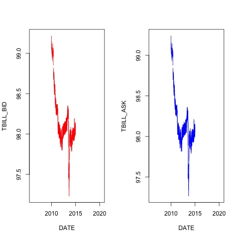

###  bid yield and ask yield
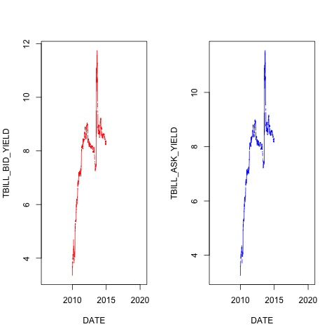

###  US repo bid and ask
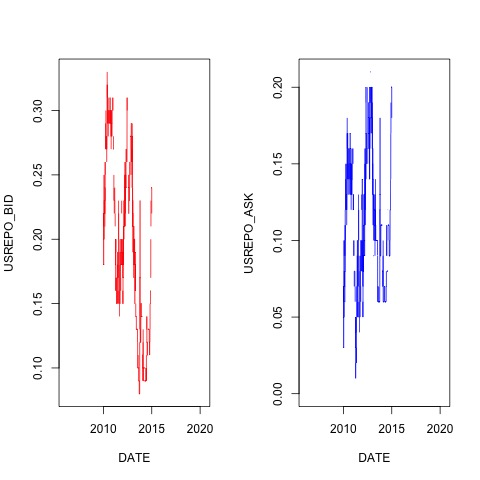

###  Trade Close
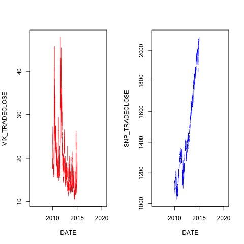

###  US Total
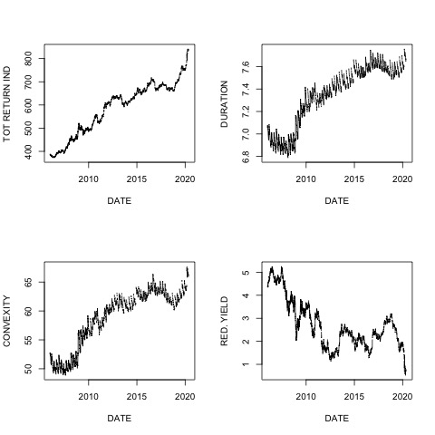

###  macro vars
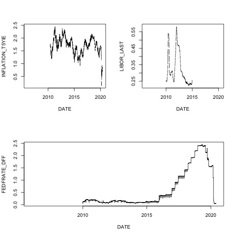

###  YIELDs

### ICAP
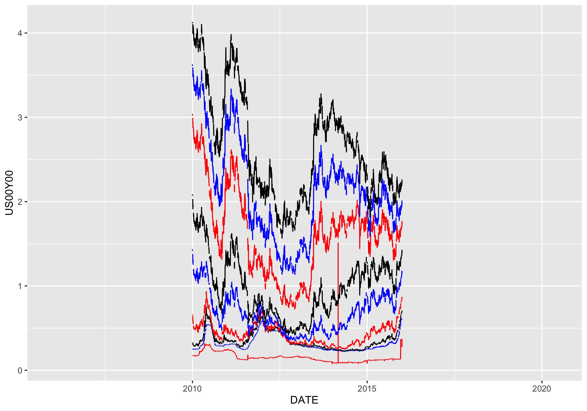

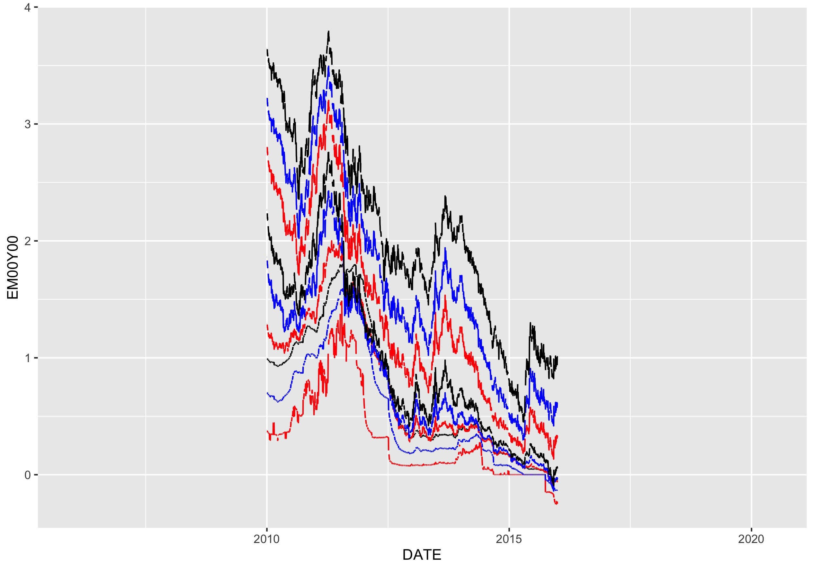

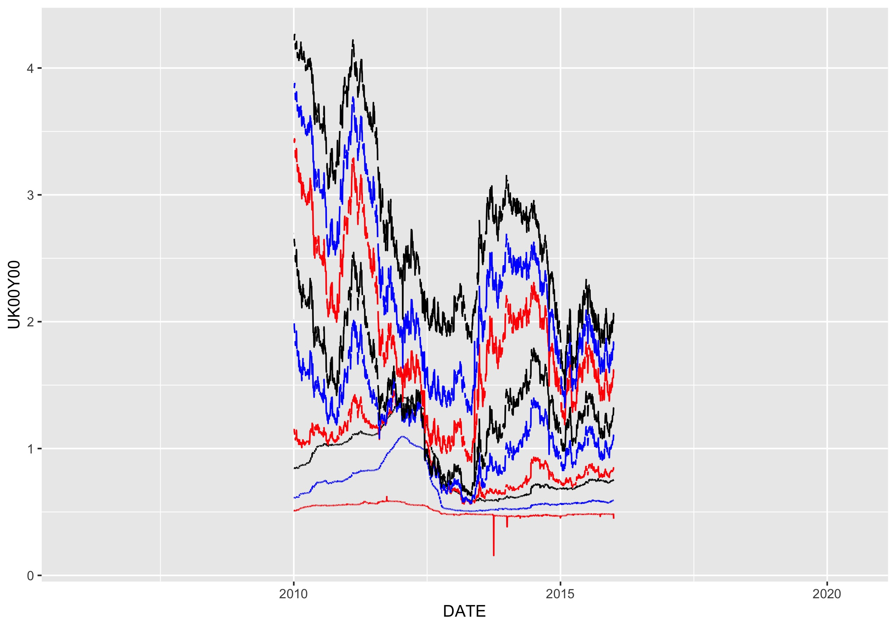

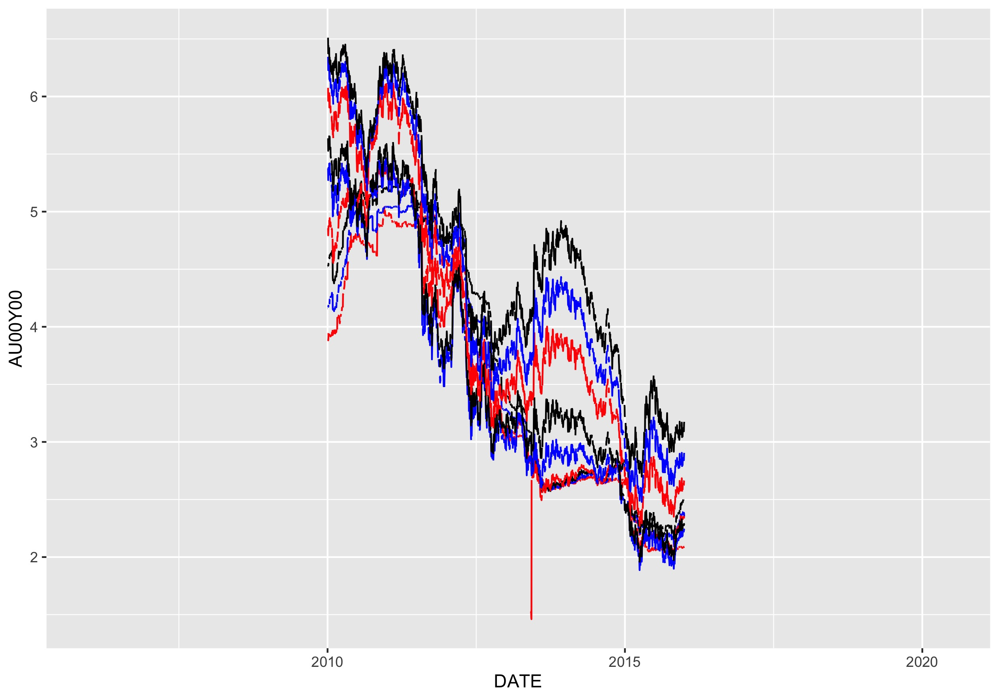

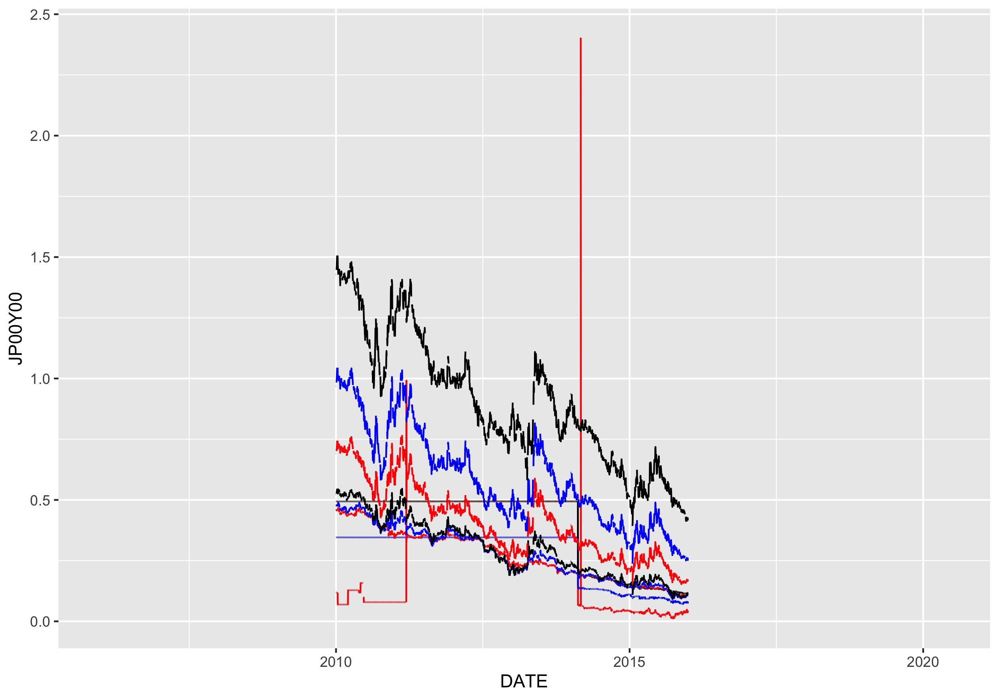

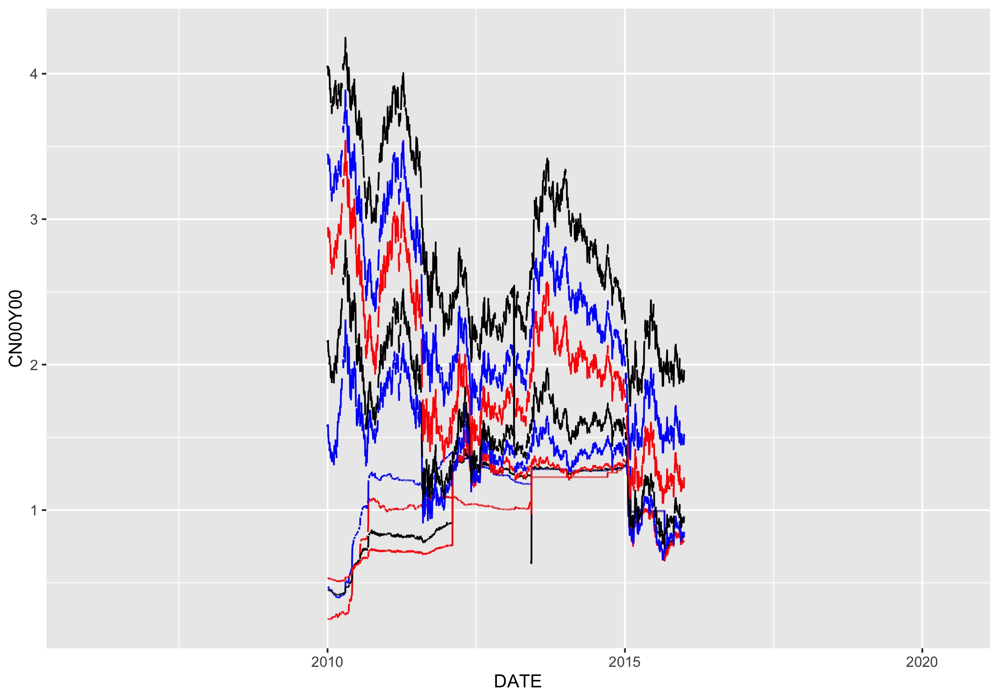

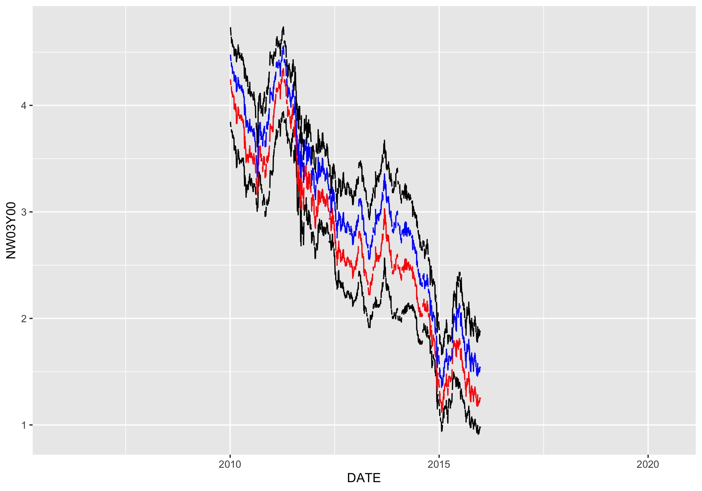

